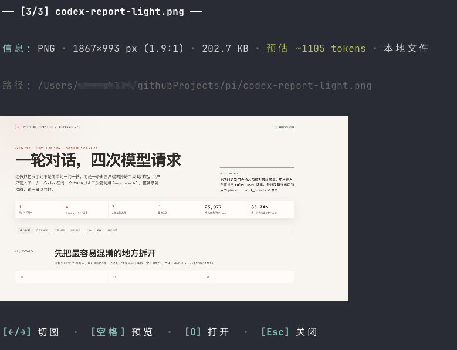

# pi-image

[English](README.md) | [简体中文](README.zh-CN.md)

> 专为 [Pi](https://pi.dev) 打造的交互式图片画廊、多模态直传、远程 URL 自动拉取、Token 消耗估算与 macOS Quick Look 快速预览插件。

`pi-image` 全面优化了在终端中使用 Pi 时的视觉交互体验。它可以自动捕获剪贴板截图、本地文件路径以及远程 HTTP/HTTPS 图片链接，并将其转化为多模态附件直传给大模型；同时提供了基于终端内联图形与 macOS 原生快速预览的交互式画廊。



---

## 核心特性

- **多模态附件直传**：自动提取本地文件、剪贴板截图或网络图片，以 Base64 附件直接发送给视觉大模型。将提示词中的冗长文件路径简化替换为 `[image #1: filename]` 紧凑标签，消除模型浪费工具轮次（`curl`/`fetch`）去读取本地图片的额外开销。
- **远程图片自动缓存**：直接在提问中粘贴 `http://` 或 `https://` 图片链接；插件自动下载并缓存至本地临时目录，内置 20MB 大小防护与 8 秒超时机制。
- **终端交互式画廊 (`/image`)**：支持终端内联图片渲染（兼容 Kitty 协议，非兼容终端自动降级为 ASCII 占位）。支持使用 `←` / `→` 或 `N` / `P` 双向连续翻页切图。
- **macOS 原生快速预览 (`空格` 键)**：在画廊中按 `空格` 键，毫秒级弹出 macOS 系统级原生 Quick Look 快速预览浮窗。看完随手按空格或 `Esc` 瞬时关闭，窗口焦点无缝留在终端，不打断输入心智。
- **系统应用独立打开 (`O` 键)**：在画廊中按 `O` 键，直接在 macOS“预览 App”（或 Linux `xdg-open` / Windows 默认图片查看器）中独立打开大图，满足涂鸦标注、裁剪或缩放需求。
- **结构化元信息栏 (Meta Bar)**：实时展示格式、分辨率、宽高比、物理大小，并根据视觉模型规范（512×512 Tile 算法）**精准估算并高亮当前图片占用的 Context Token 消耗**。
- **严格会话隔离**：图片历史记录与当前会话 ID 强绑定。通过 `/new` 开启新会话时自动重置，避免旧会话图片干扰。

---

## 安装说明

### 从 GitHub 安装

```bash
pi install git:github.com/cqh6666/pi-image
```

### 本地源码安装

```bash
pi install /path/to/pi-image
```

或者直接添加到全局配置文件 `~/.pi/agent/settings.json`：

```json
{
  "packages": [
    "/path/to/pi-image"
  ]
}
```

### 免安装单次试用

```bash
pi -e git:github.com/cqh6666/pi-image
```

---

## 使用指南

### 1. 附加图片

- **剪贴板截图**：直接按 `Ctrl+V`（或在 Mac 终端中 `Cmd+V` 粘贴路径）。
- **网络图片**：直接粘贴 URL，如 `https://example.com/screenshot.png`。
- **本地文件**：在提问中提及相对或绝对路径，如 `./diagram.png` 或 `~/Desktop/mockup.jpg`。

按回车提交时，`pi-image` 会自动将图片作为多模态附件附加给模型，并在提示词中将长路径替换为简洁的 `[image #1: filename]`。

### 2. 画廊控制命令

| 命令 | 说明 |
| :--- | :--- |
| `/image` | 打开画廊并查看最新一张图片 |
| `/image <序号>` | 打开画廊并直接跳转到第 N 张图片 (例如 `/image 2`) |
| `/image list` | 打开交互式选择弹窗列表 |
| `/image <路径\|URL>` | 直接预览指定的本地文件或网络图片链接 |
| `/image clear` | 清空当前会话所记录的图片历史 |
| `/image help` | 显示命令用法摘要 |

### 3. 画廊键盘快捷键

当画廊处于打开状态时：

| 按键 | 对应动作 |
| :--- | :--- |
| `空格` (Space) | **macOS 原生快速预览** (Quick Look 悬浮窗) |
| `O` | **系统应用打开** (调用 Preview.app) |
| `→` / `↓` / `N` / `Tab` | 切换到下一张图片 |
| `←` / `↑` / `P` / `Shift+Tab` | 切换到上一张图片 |
| `Esc` / `Q` | 关闭画廊并返回终端光标 |

---

## 开源协议

[MIT](LICENSE)
